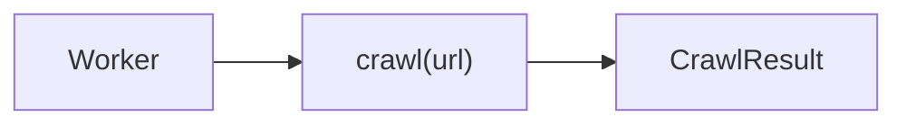

# Architecture

## Purpose

`crawl` is a resilient web-content extraction library that crawls a URL and returns high-signal markdown plus metadata using a fallback chain.

## Component Map

- `src/index.ts`
  - Public API: `crawl(url, options)` and `closeBrowser()`
  - Strategy pipeline: `fetch -> jsdom -> playwright -> scrapeDo`
  - Shared extraction: `extractFromHtml()` using Readability + Turndown
  - Acceptance gate: `isResultAcceptable()` + blocked-page heuristics
- `src/index.test.ts`
  - Behavioral tests for strategy order, skipping disabled steps, and `CrawlError` attempts payload

## End-to-End Flow



## Crawl Code Flow

`crawl()` in `src/index.ts` builds headers, evaluates enabled strategies, and records each attempt in an `attempts` array. The first acceptable result returns immediately; if all enabled strategies fail, `crawl()` throws `CrawlError` with full attempt details.

```mermaid
flowchart TD
    A[crawl(url, options)] --> B[buildHeaders]
    B --> C[attempts = []]
    C --> D{fetch enabled}
    D -->|yes| E[fetchHtml + extractFromHtml]
    D -->|no| I
    E --> F{isResultAcceptable}
    F -->|yes| G[attempts += fetch ok]
    G --> H[return CrawlResult strategy=fetch]
    F -->|no| I[jsdom step]
    I --> J{jsdom enabled}
    J -->|yes| K[renderWithJsdom + extractFromHtml]
    J -->|no| N
    K --> L{isResultAcceptable}
    L -->|yes| M[return CrawlResult strategy=jsdom]
    L -->|no| N[playwright step]
    N --> O{playwright enabled}
    O -->|yes| P[withPlaywright + extractFromHtml]
    O -->|no| S
    P --> Q{isResultAcceptable}
    Q -->|yes| R[return CrawlResult strategy=playwright]
    Q -->|no| S[scrape.do step]
    S --> T{scrape.do enabled}
    T -->|yes| U[withScrapeDo + extractFromHtml]
    T -->|no| X
    U --> V{isResultAcceptable}
    V -->|yes| W[return CrawlResult strategy=scrapeDo]
    V -->|no| X[throw CrawlError with attempts]
```

## Acceptance and Failure Model

Each strategy result is accepted only when all checks pass:

- `html.trim().length >= minHtmlLength`
- `markdown.trim().length >= minMarkdownLength`
- `wordCount >= minWordCount`
- `isLikelyBlocked(...) === false`

If an attempt fails, `attempts[]` stores either:

- `reason` for threshold rejection, or
- `error` for thrown exceptions (HTTP error, timeout, browser error, etc.)

This makes fallback behavior observable and debuggable in production workers.

## Playwright Context Lifecycle

Playwright is pooled and reused when headers are unchanged; context is recreated when header/user-agent shape changes.

```mermaid
flowchart TD
    A[withPlaywright(url, options, headers)] --> B[getBrowser(headers)]
    B --> C[Compute headers key]
    C --> D{Existing context key matches}
    D -->|yes| E[Reuse context]
    D -->|no| F{Context init in progress}
    F -->|yes| G[Await init, re-check key]
    F -->|no| H[Launch browser if needed]
    H --> I[Close prior context if present]
    I --> J[newContext with userAgent + extraHTTPHeaders]
    J --> E
    E --> K[newPage]
    K --> L{blockResources}
    L -->|yes| M[Abort image/media/font requests]
    L -->|no| N[Continue all]
    M --> O[page.goto + wait strategy]
    N --> O
    O --> P[page.content -> extractFromHtml]
    P --> Q[page.close]
    Q --> R[return CrawlResult]
```

## Operational Notes

- `closeBrowser()` should be called on shutdown to release Playwright resources.
