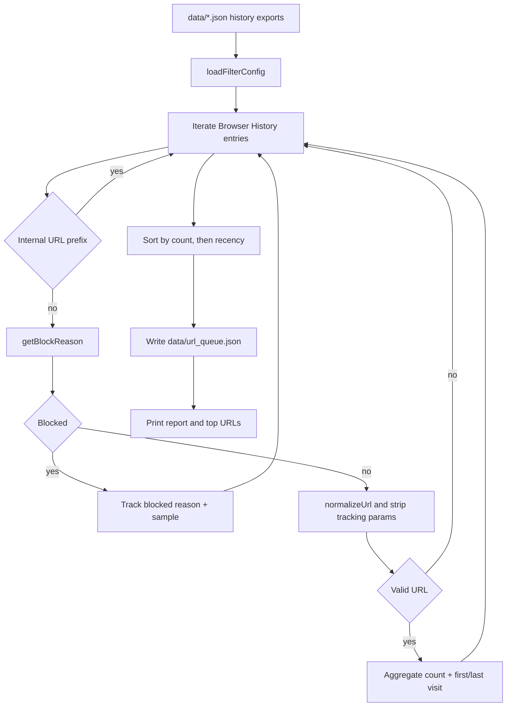
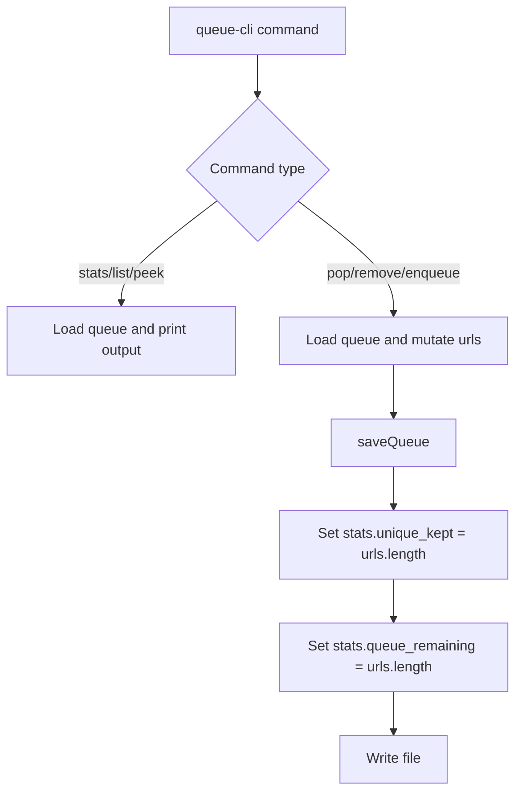

# Architecture

## Purpose

`crawl` is a resilient web-content extraction project with two connected responsibilities:

1. Crawl a URL and return high-signal markdown plus metadata using a fallback chain.
2. Build and operate a deterministic URL work queue from browser history exports.

The crawler is library-first (`src/index.ts`). The queue tools are CLI-first (`scripts/url-history.ts`, `scripts/queue-cli.mjs`).

## Component Map

- `src/index.ts`
  - Public API: `crawl(url, options)` and `closeBrowser()`
  - Strategy pipeline: `fetch -> jsdom -> playwright -> scrapeDo`
  - Shared extraction: `extractFromHtml()` using Readability + Turndown
  - Acceptance gate: `isResultAcceptable()` + blocked-page heuristics
- `src/index.test.ts`
  - Behavioral tests for strategy order, skipping disabled steps, and `CrawlError` attempts payload
- `scripts/url-history.ts`
  - Offline queue builder from history exports in `data/*.json`
  - URL/title/domain filtering and normalization
  - Writes `data/url_queue.json`
- `scripts/queue-cli.mjs`
  - Queue operations: `stats`, `list`, `peek`, `pop`, `remove`, `enqueue`
  - Mutations persist directly to `data/url_queue.json`

## End-to-End Flow

```mermaid
flowchart LR
    A[History exports in data/*.json] --> B[scripts/url-history.ts]
    B --> C[data/url_queue.json]
    C --> D[scripts/queue-cli.mjs]
    D --> E[Worker picks URL]
    E --> F[crawl(url, options)]
    F --> G[CrawlResult or CrawlError]
```

## Crawl Code Flow

`crawl()` in `src/index.ts` builds headers, evaluates enabled strategies, and records each attempt in an `attempts` array. The first acceptable result returns immediately; if all enabled strategies fail, `crawl()` throws `CrawlError` with full attempt details.

```mermaid
flowchart TD
    A[crawl(url, options)] --> B[buildHeaders]
    B --> C[attempts = []]
    C --> D{fetch enabled}
    D -->|yes| E[fetchHtml + extractFromHtml]
    D -->|no| I
    E --> F{isResultAcceptable}
    F -->|yes| G[attempts += fetch ok]
    G --> H[return CrawlResult strategy=fetch]
    F -->|no| I[jsdom step]
    I --> J{jsdom enabled}
    J -->|yes| K[renderWithJsdom + extractFromHtml]
    J -->|no| N
    K --> L{isResultAcceptable}
    L -->|yes| M[return CrawlResult strategy=jsdom]
    L -->|no| N[playwright step]
    N --> O{playwright enabled}
    O -->|yes| P[withPlaywright + extractFromHtml]
    O -->|no| S
    P --> Q{isResultAcceptable}
    Q -->|yes| R[return CrawlResult strategy=playwright]
    Q -->|no| S[scrape.do step]
    S --> T{scrape.do enabled}
    T -->|yes| U[withScrapeDo + extractFromHtml]
    T -->|no| X
    U --> V{isResultAcceptable}
    V -->|yes| W[return CrawlResult strategy=scrapeDo]
    V -->|no| X[throw CrawlError with attempts]
```

## Acceptance and Failure Model

Each strategy result is accepted only when all checks pass:

- `html.trim().length >= minHtmlLength`
- `markdown.trim().length >= minMarkdownLength`
- `wordCount >= minWordCount`
- `isLikelyBlocked(...) === false`

If an attempt fails, `attempts[]` stores either:

- `reason` for threshold rejection, or
- `error` for thrown exceptions (HTTP error, timeout, browser error, etc.)

This makes fallback behavior observable and debuggable in production workers.

## Playwright Context Lifecycle

Playwright is pooled and reused when headers are unchanged; context is recreated when header/user-agent shape changes.

```mermaid
flowchart TD
    A[withPlaywright(url, options, headers)] --> B[getBrowser(headers)]
    B --> C[Compute headers key]
    C --> D{Existing context key matches}
    D -->|yes| E[Reuse context]
    D -->|no| F{Context init in progress}
    F -->|yes| G[Await init, re-check key]
    F -->|no| H[Launch browser if needed]
    H --> I[Close prior context if present]
    I --> J[newContext with userAgent + extraHTTPHeaders]
    J --> E
    E --> K[newPage]
    K --> L{blockResources}
    L -->|yes| M[Abort image/media/font requests]
    L -->|no| N[Continue all]
    M --> O[page.goto + wait strategy]
    N --> O
    O --> P[page.content -> extractFromHtml]
    P --> Q[page.close]
    Q --> R[return CrawlResult]
```

## Queue Generation Flow (`scripts/url-history.ts`)



### Queue File Shape

`data/url_queue.json` is written as:

- `stats.total_items`
- `stats.unique_kept`
- `stats.blocked_items`
- `stats.blocked_by_reason`
- `urls[]` entries: `url`, `count`, `lastVisit`, `title`

Note: queue length is derived from `urls.length`. `queue_size` is a CLI display field, not a generator output field.

## Queue CLI Flow (`scripts/queue-cli.mjs`)



## Operational Notes

- `closeBrowser()` should be called on shutdown to release Playwright resources.
- Queue tooling is intentionally file-based for deterministic, agent-friendly automation.
- `queue:stats` reports a computed `queue_size` from `urls.length`; mutations persist `queue_remaining`.
